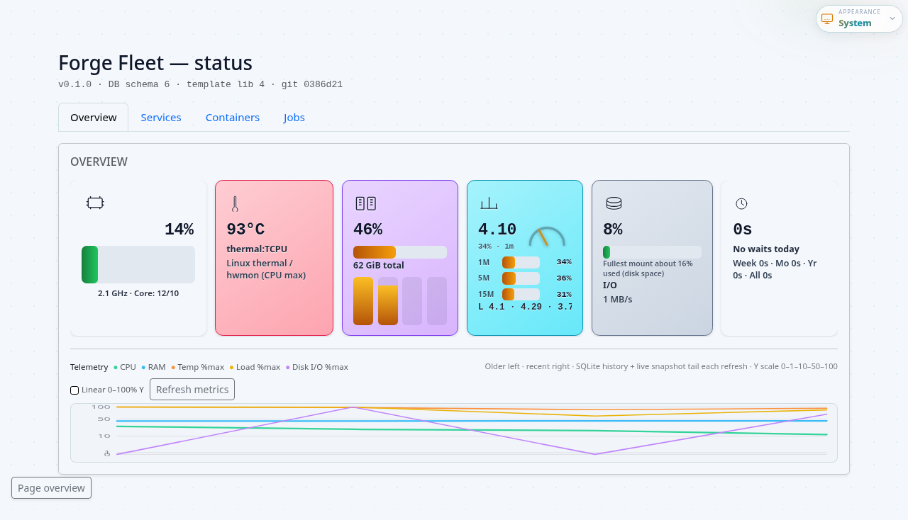

# Forge Fleet — Overview

Forge Fleet is a small **HTTP service** (with optional **bearer** authentication) that **orchestrates Docker** on the **same host**. Clients submit **`docker_argv`** jobs; Fleet tracks them in **SQLite** (`fleet.sqlite`), streams logs, and exposes **health**, **telemetry**, and a read-only **admin** dashboard at `/admin/`.

The MVP design assumes the **Forge Lenses** workspace runs on the **same machine** as Fleet so **bind-mount paths** in job argv match the host filesystem—this is why **Docs Health** `session_step` can offload container work to Fleet instead of using an in-process `docker` CLI.

## Who uses Fleet

1. **Forge Lenses (Studio)** — Settings → Fleet: `LENSES_FLEET_URL` + `LENSES_FLEET_TOKEN`. Docs Health uses Fleet for configurable `session_step` runs; **Test Fleet** calls `POST /v1/admin/test-fleet` via the workspace server (not from the browser).
2. **Operators** — Browser `/admin/` for CPU/RAM/load, recent jobs, container type swimlanes, optional **Forge LLM** service start/stop, and (where configured) **Update Fleet** / git self-update.
3. **forge-certificators / shared Granite hostname** — Often the same public hostname as Fleet for TLS and routing; LLM endpoints are configured in certificators, not Fleet. See [CADDY-UNIFIED-GRANITE.md](CADDY-UNIFIED-GRANITE.md) for one-hostname patterns.

## Mental model

| Concept | Meaning |
|--------|--------|
| **Job** | A `POST /v1/jobs` **docker_argv** run: argv list, `session_id`, `meta` (includes `container_class`, optional `workspace_upload_required`). |
| **`fleet.sqlite`** | Persistent store for jobs, telemetry samples, cooldown events, schema version—scoped to **this Fleet process** and its **`FLEET_DATA_DIR`**. |
| **Container types** | On-disk catalog **`etc/containers/types.json`**: MECE categories **system** / **job** / **service** and capabilities (`allow_docker_argv_jobs`, etc.). |
| **Managed services** | **`etc/services/<id>.json`** entries for long-lived **forge_llm** stacks; start/stop via `/v1/container-services/*`. |
| **Templates** | `GET /v1/templates` catalog (e.g. `host_cpu_probe` for Studio test probes). |

## Typical ports

| Context | Port | Notes |
|---------|------|--------|
| README / Compose “standard” dev | **18765** | `python3 -m fleet_server --port 18765` or compose default. |
| User install (`install-user.sh`) | **18766** | Default in docs for `systemd --user` layout. |
| Playwright e2e (`e2e/start-fleet-server.sh`) | **19876** | Disposable `FLEET_DATA_DIR` under `.fleet-e2e-data`. |

If **Studio** points at one URL and you open **`/admin/`** on another, you will see **different** job rows—each process has its own DB.

## Documentation map (reading order)

| Doc | Purpose |
|-----|--------|
| [README.md](../README.md) | Install, run, compose, “update fleet”, versioning, roadmap, limitations. |
| [API-REFERENCE.md](API-REFERENCE.md) | Full `/v1/*` table, auth rules, host-metrics injection, `git-self-update`. |
| [GIT-INSTALL.md](GIT-INSTALL.md) | Fresh clone → `git-install.sh` / systemd. |
| [HOST-BOOTSTRAP.md](HOST-BOOTSTRAP.md) | OS packages (Docker, Python, git, rsync) before install. |
| [WORKSPACE_UPLOAD.md](WORKSPACE_UPLOAD.md) | `PUT /v1/jobs/{id}/workspace` gzip tarball flow. |
| [CONTAINER-TEMPLATES.md](CONTAINER-TEMPLATES.md) | Template library and container type contracts. |
| [ADMIN-STATUS-OVERVIEW-DESIGN.md](ADMIN-STATUS-OVERVIEW-DESIGN.md) | Admin tiles, KPI layout, release identity. |
| [CADDY-SYSTEMD.md](CADDY-SYSTEMD.md) / [CADDY-UNIFIED-GRANITE.md](CADDY-UNIFIED-GRANITE.md) | Reverse proxy and unified hostname setups. |
| [FORGE-LCDL.md](FORGE-LCDL.md) | Relationship between **Fleet** orchestration and **`forge-lcdl`** governed LLM library — not interchangeable. |
| [CHANGELOG.md](../CHANGELOG.md) | Release notes; host operator section. |

## Admin UI screenshot

The `/admin/` dashboard (overview tiles, charts, jobs) can be refreshed for docs using Playwright (see [assets/README.md](assets/README.md)):

```bash
cd forge-fleet
npm ci
npx playwright test e2e/docs-screenshots.spec.ts
```

The e2e harness starts Fleet on **`127.0.0.1:19876`** (see `playwright.config.ts`) unless **`CI=1`** or an existing server already serves that URL (`reuseExistingServer`). This is **not** the same port as a typical local Studio setup (**18765** / **18766**).



## For automation and IDE agents

Short **operator phrase** (meaning depends on **Cursor/workspace rules**, not only this repo):

- **“Update fleet”** / ship release — usually **`./scripts/update-fleet.sh`** (submodule sync, semver bump, commit, push, install scripts). Optional **`--remote-git-self-update`** hits **`POST /v1/admin/git-self-update`** on a remote base URL with a bearer token.
- **“Update service”** (localhost) — **`git pull`** in **`~/forge-fleet`** (or fallback clone), then **`./update-user.sh`** / restart **`forge-fleet.service`**; **not** the same as the release script unless the user asked for that workflow.
- **“Update certificator”** — certificator refresh **plus** remote **`git-self-update`** and local Fleet pull; see workspace rules for the full ordering.

Do not store bearer tokens in Markdown; use env or secret files as described in [README.md](../README.md) and `systemd/environment.example`.

## Related

Full endpoint list: [API-REFERENCE.md](API-REFERENCE.md). Private handbook build consumes this repo’s Markdown via **forge-fleet-website** (`generator/build-site.py`).
