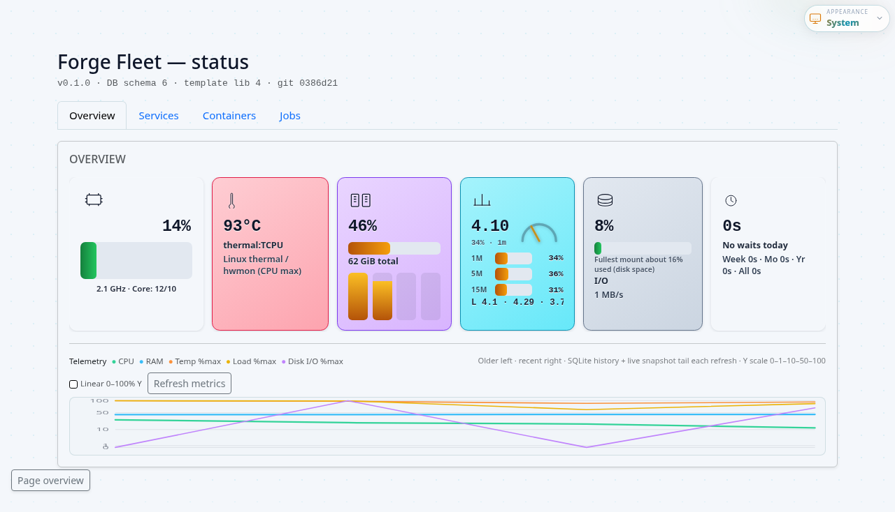

# Learn 101 — Admin dashboard and Studio

**Outcome:** you know what **`/admin/`** shows, how Studio binds Fleet, and where screenshots come from.

**Audience:** operators and Lenses users. **Time:** ~15 minutes plus optional Playwright run. **Verify:** you can open **`/admin/`** on your Fleet base URL and correlate a job row with **`GET /v1/jobs/{id}`**.

`/admin/` is a **read-only** operator view—CPU/RAM/load, recent jobs, container-type swimlanes, optional **Forge LLM** controls, **Update Fleet**, and **`git`** self-update when configured.

## Connect to a remote Fleet

Use **Connect…** (scope bar) for a four-step wizard:

1. **Local** — health check on this Fleet host.
2. **Remote** — peer id, public base URL (`<FLEET_PUBLIC_BASE_URL>`), bearer (`<FLEET_BEARER_TOKEN>`).
3. **Test** — save peer, probe `/v1/health`, switch to read-only remote dashboard.
4. **Edge** — copy-paste **root** instructions for `cloudflared` + unified Caddy on the server (Fleet does not create tunnels automatically).

**Manage peers…** opens the advanced peer editor (same `PUT /v1/remote-peers/*` API). When editing, leave bearer empty to keep the stored token.

Full operator path: **[Connect to remote Fleet](08-connect-remote-fleet.md)**.

Forge Lenses (Studio): **Settings → Fleet** binds **`LENSES_FLEET_URL`** + **`LENSES_FLEET_TOKEN`**. **Docs Health** runs configurable **`session_step`** jobs via Fleet’s Docker host; **Test Fleet** calls **`POST /v1/admin/test-fleet`** from the **workspace server** (never directly from arbitrary browser origins).

Forge **LCDL** (governed LLM tasks/operators) stays a **separate** concern—Fleet runs containers; **`forge-lcdl`** orchestrates deterministic LLM work. See **[Forge LCDL ↔ Fleet](../reference/04-forge-lcdl-relationship.md)**.

## Forge LLM helpers

See **[Operate 301 — Troubleshooting](../operate-301/04-troubleshooting.md)** for operator-visible failure modes (**502** via Caddy, template build regressions, etc.).

## Screenshots workflow

`/admin/` marketing-quality PNGs regenerate through Playwright (details in **`[docs/assets/README.md](../assets/README.md)`**).

```bash
cd forge-fleet
npm ci
npx playwright test e2e/docs-screenshots.spec.ts
```

The harness targets **`127.0.0.1:19876`** by default—**not** the usual **`18765` / **`18766`** loop.



## Phrases automation uses

These collide with Cursor workspace conventions—prefer **explicit** wording in CI notes:

| Phrase | Usually means |
|--------|----------------|
| **“Update fleet”** | **`./scripts/update-fleet.sh`** (semver bump → push → install paths). Optional **`--remote-git-self-update`** hits **`POST /v1/admin/git-self-update`** on a remote Fleet base URL. |
| **“Update service”** | Local **`~/forge-fleet`** pull plus **`./update-user.sh`** / **`systemctl --user restart forge-fleet.service`**—not the semver release script unless the operator asked for that. |
| **“Update certificator”** | Certificator refresh **plus** remote **`git-self-update`** hook—see workspace Forge rules ordering. |

Do **not** store bearer tokens inside Markdown copies—prefer env files (**`forge-fleet.env`**, systemd drops) referenced from **[README.md](../../README.md)** and **`systemd/environment.example`**.

## Related

| Topic | Doc |
|-------|-----|
| Caddy/TLS façade | **[Caddy systemd](../build-201/03-caddy-systemd.md)** · **[Unified Granite](../build-201/04-caddy-unified-granite.md)** |
| Admin tile design | **[Maintainers · Admin KPI design](../maintainers/01-admin-status-overview-design.md)** |
| Release operations | **[Upgrade & remote self-update](../operate-301/05-upgrade-release-and-remote-update.md)** |
